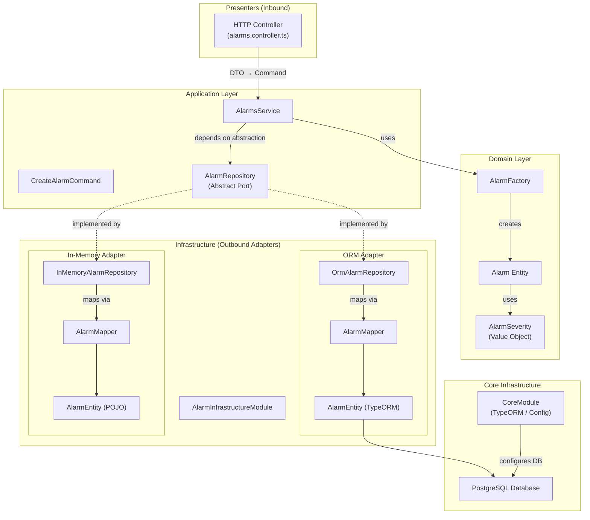
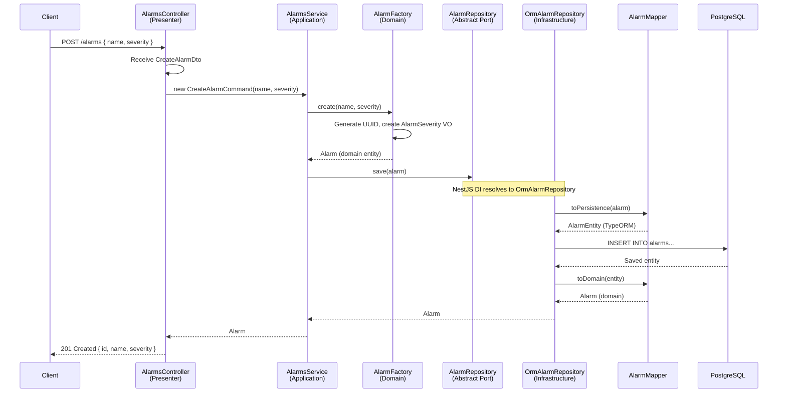

# 🏗️ Advanced Architecture Patterns — Full Architectural Walkthrough

## Overview

This is a **NestJS** application that implements **Hexagonal Architecture** (also called **Ports & Adapters** or **Clean Architecture**) for an **Alarms** domain. The architecture's central idea is to **isolate the business logic (domain + application) from all external concerns** (databases, HTTP, etc.) so that external dependencies can be swapped without touching a single line of business code.

The project demonstrates this by providing **two interchangeable persistence backends** — an **in-memory store** and a **PostgreSQL (TypeORM) ORM** — selected at bootstrap time with a single configuration change.

---

## Why This Architecture Works

### The Core Principle: Dependency Inversion

The entire architecture rests on the **Dependency Inversion Principle (DIP)**:

> *"High-level modules should not depend on low-level modules. Both should depend on abstractions."*

In practice this means:
1. The **Application layer** defines an **abstract port** (`AlarmRepository`) — a contract for *what* it needs.
2. The **Infrastructure layer** provides **concrete adapters** (`InMemoryAlarmRepository`, `OrmAlarmRepository`) — implementations of *how* to fulfill that contract.
3. At **runtime**, NestJS's dependency injection wires the correct adapter to the port based on the chosen driver.

This gives you:
- ✅ **Testability** — Swap the ORM for in-memory in tests; no database required.
- ✅ **Flexibility** — Switch persistence technologies (Postgres → MongoDB → DynamoDB) without changing business logic.
- ✅ **Separation of Concerns** — Each layer has one job and knows nothing about layers below it.
- ✅ **Domain Purity** — The `Alarm` domain model is never polluted with database decorators or HTTP details.

---

## High-Level Architecture Diagram



---

## Complete Directory Structure & File-by-File Breakdown

```
src/
├── main.ts                          # App entry point
├── app.module.ts                    # Root module (composition root)
├── app.controller.ts                # Root health-check controller
├── app.service.ts                   # Root service
├── common/
│   └── interfaces/
│       └── application-bootstrap-options.interface.ts   # Driver config type
├── core/
│   └── core.module.ts               # Cross-cutting infrastructure (DB setup)
└── alarms/                          # ═══ BOUNDED CONTEXT ═══
    ├── domain/                      # ── DOMAIN LAYER ──
    │   ├── alarm.ts                 # Domain entity
    │   ├── factories/
    │   │   └── alarm.factory.ts     # Factory pattern for entity creation
    │   └── value-objects/
    │       └── alarm-severity.ts    # Value Object with validation
    ├── application/                 # ── APPLICATION LAYER ──
    │   ├── alarms.module.ts         # Application module definition
    │   ├── alarms.service.ts        # Application service (use cases)
    │   ├── commands/
    │   │   └── create-alarm.command.ts   # Command object
    │   └── ports/
    │       └── create-create-alarm.repository.ts  # Abstract port (repository contract)
    ├── presenters/                  # ── PRESENTER LAYER (inbound) ──
    │   └── http/
    │       ├── alarms.controller.ts # HTTP REST controller
    │       └── dto/
    │           ├── create-alarm.dto.ts   # Inbound DTO
    │           └── update-alarm.dto.ts   # Inbound DTO (partial)
    └── infrastructure/              # ── INFRASTRUCTURE LAYER (outbound) ──
        ├── alarm-infrastructure.module.ts   # Driver switch module
        └── persistence/
            ├── orm/                 # ── ORM ADAPTER ──
            │   ├── orm-persistence.module.ts
            │   ├── entities/
            │   │   └── alarm.entity.ts      # TypeORM entity
            │   ├── mappers/
            │   │   └── alarm.mapper.ts      # Domain ⟷ Persistence mapper
            │   └── repositories/
            │       └── create-create-alarm.repository.ts  # Concrete ORM repository
            └── in-memory/           # ── IN-MEMORY ADAPTER ──
                ├── in-memory-persistence.module.ts
                ├── entities/
                │   └── alarm.entity.ts      # Plain POJO entity
                ├── mappers/
                │   └── alarm.mapper.ts      # Domain ⟷ Persistence mapper
                └── repositories/
                    └── create-create-alarm.repository.ts  # Concrete in-memory repository
```

---

## Layer-by-Layer File Explanation

### 1. Entry Point & Composition Root

#### [main.ts](file:///d:/Projects/Next%20JS/advanced-architecture-patterns/src/main.ts)
**Role:** Application entry point — the bootstrap function.

```typescript
const app = await NestFactory.create(AppModule.register({ driver: 'orm' }));
```

> [!IMPORTANT]
> This is where the **entire infrastructure strategy is decided**. Changing `'orm'` to `'in-memory'` swaps out the database persistence for an in-memory Map — zero other code changes required. This one line is the "switch" that the whole hexagonal architecture is built around.

**Why here:** NestJS requires a single entry point. By calling `AppModule.register()` with configuration options *before* the application is created, we ensure the correct modules are wired into the DI container at startup.

---

#### [app.module.ts](file:///d:/Projects/Next%20JS/advanced-architecture-patterns/src/app.module.ts)
**Role:** The **Composition Root** — the place where all the architectural layers are assembled together.

```typescript
static register(options: ApplicationBootstrapOptions) {
  return {
    module: AppModule,
    imports: [
      CoreModule.forRoot(options),                              // Infrastructure
      AlarmsModule.withInfrastructure(                          // Domain + Application
        AlarmInfrastructureModule.use(options.driver),           // + Adapter selection
      ),
    ],
  };
}
```

**Why it works:** The `register()` static method uses NestJS **Dynamic Modules** to compose the application at runtime. It:
1. Passes the driver option to `CoreModule` (so it knows whether to set up TypeORM or not).
2. Passes the selected infrastructure adapter *into* the application module, not the other way around — preserving the dependency rule.

**Why here:** The root module is the natural composition root. It's the only place that knows about *all* layers simultaneously.

---

#### [app.controller.ts](file:///d:/Projects/Next%20JS/advanced-architecture-patterns/src/app.controller.ts) & [app.service.ts](file:///d:/Projects/Next%20JS/advanced-architecture-patterns/src/app.service.ts)
**Role:** Default health-check endpoint (`GET /` → `"Hello World!"`). Standard NestJS scaffolding.

**Why here:** Top-level app concerns that don't belong to any bounded context. Typically used for health checks, root-level middleware, etc.

---

### 2. Common / Shared Kernel

#### [application-bootstrap-options.interface.ts](file:///d:/Projects/Next%20JS/advanced-architecture-patterns/src/common/interfaces/application-bootstrap-options.interface.ts)
**Role:** Defines the **contract for application configuration**.

```typescript
export interface ApplicationBootstrapOptions {
  driver: 'orm' | 'in-memory';
}
```

**Why it exists:** This type-safe interface ensures that every module that participates in the driver-selection mechanism speaks the same language. It constrains the `driver` to exactly two valid values.

**Why in `common/`:** This interface is shared across multiple layers (entry point, core, infrastructure). Placing it in `common/` prevents circular dependencies and signals it's a **shared kernel** — not owned by any single bounded context.

---

### 3. Core Module

#### [core.module.ts](file:///d:/Projects/Next%20JS/advanced-architecture-patterns/src/core/core.module.ts)
**Role:** **Cross-cutting infrastructure concerns** — specifically, database connection setup.

```typescript
static forRoot(options: ApplicationBootstrapOptions) {
  const imports = options.driver === 'orm'
    ? [TypeOrmModule.forRoot({ /* postgres config */ })]
    : [];
  return { module: CoreModule, imports };
}
```

**Why it works:** Using the `forRoot()` pattern (a NestJS convention for configurable modules), it conditionally registers the TypeORM connection. If the driver is `'in-memory'`, no database module is loaded at all — the application runs entirely without a database.

**Why in `core/`:** Database configuration is a **global, cross-cutting concern** — it's not specific to the Alarms domain. If you add another bounded context (e.g., `Users`, `Notifications`), they would all share this same database connection. Separating it from the `alarms/` module keeps domain modules database-agnostic.

> [!NOTE]
> The database credentials are read from environment variables via `process.env`, with the `.env` file loaded by `ConfigModule.forRoot({ isGlobal: true })` in `app.module.ts`.

---

### 4. Alarms Bounded Context — Domain Layer

> [!TIP]
> The Domain Layer is the **innermost circle** of the hexagonal architecture. It has **zero dependencies on frameworks**, databases, or HTTP. It contains only pure business logic.

#### [alarm.ts](file:///d:/Projects/Next%20JS/advanced-architecture-patterns/src/alarms/domain/alarm.ts)
**Role:** The **Domain Entity** — the core business object.

```typescript
export class Alarm {
  constructor(
    public id: string,
    public name: string,
    public severity: AlarmSeverity,
  ) {}
}
```

**Why it works:** It's a plain TypeScript class with no decorators, no ORM annotations, no framework coupling. The `severity` field uses a **Value Object** (`AlarmSeverity`) rather than a raw string, enforcing domain rules at the type level.

**Why in `domain/`:** This is the purest representation of a business concept. It must never depend on infrastructure. Placing it here signals: *"this file contains business rules and nothing else."*

---

#### [alarm-severity.ts](file:///d:/Projects/Next%20JS/advanced-architecture-patterns/src/alarms/domain/value-objects/alarm-severity.ts)
**Role:** A **Value Object** — an immutable, self-validating domain concept.

```typescript
export class AlarmSeverity {
  constructor(readonly value: 'critical' | 'high' | 'medium' | 'low') {}
  equals(severity: AlarmSeverity) {
    return this.value === severity.value;
  }
}
```

**Why it exists:** Instead of passing raw strings around and hoping someone types `"critical"` correctly, this class:
- **Constrains** values to exactly four valid severities at the type level.
- **Encapsulates** equality logic (two severities are equal if their *values* are equal, not their *references*).
- **Self-documents** what a "severity" means in this domain.

**Why in `value-objects/`:** Value Objects are a DDD building block. Grouping them in a sub-folder makes the domain model scannable and communicates their purpose.

---

#### [alarm.factory.ts](file:///d:/Projects/Next%20JS/advanced-architecture-patterns/src/alarms/domain/factories/alarm.factory.ts)
**Role:** **Factory Pattern** — encapsulates entity creation logic.

```typescript
create(name: string, severity: string) {
  const alarmId = randomUUID();
  const alarmSeverity = new AlarmSeverity(severity as unknown as AlarmSeverity['value']);
  return new Alarm(alarmId, name, alarmSeverity);
}
```

**Why it exists:** Entity creation involves:
1. Generating a UUID.
2. Converting a raw string into a `AlarmSeverity` Value Object.

Rather than scattering this logic across services & controllers, the factory centralizes it. If creation rules change (e.g., validation, default values), there's exactly **one place** to update.

**Why in `factories/`:** Factory is a recognized DDD pattern. Keeping it in `domain/factories/` signals that entity creation is a **domain concern**, not an application or infrastructure concern.

---

### 5. Alarms Bounded Context — Application Layer

> [!IMPORTANT]
> The Application Layer orchestrates use cases. It knows **what** needs to happen but not **how**. It depends on the domain layer and on abstract ports — never on concrete infrastructure.

#### [alarms.module.ts](file:///d:/Projects/Next%20JS/advanced-architecture-patterns/src/alarms/application/alarms.module.ts)
**Role:** NestJS module definition for the application layer.

```typescript
static withInfrastructure(infrastructureModule: Type | DynamicModule) {
  return {
    module: AlarmsModule,
    imports: [infrastructureModule],
  };
}
```

**Why it works:** The `withInfrastructure()` method accepts *any* infrastructure module as a parameter. The application layer doesn't know (or care) which concrete persistence it receives — it only knows that the imported module will provide an `AlarmRepository` implementation. This is **dependency injection at the module level**.

**Why here:** The application module is the glue between domain logic and external adapters. Placing it in `application/` centers it in the hexagonal architecture.

---

#### [alarms.service.ts](file:///d:/Projects/Next%20JS/advanced-architecture-patterns/src/alarms/application/alarms.service.ts)
**Role:** **Application Service** — implements use cases / business workflows.

```typescript
constructor(
  private readonly alarmRepository: AlarmRepository,  // ← abstract port
  private alarmFactory: AlarmFactory,                 // ← domain factory
) {}

create(createAlarmCommand: CreateAlarmCommand) {
  const alarm = this.alarmFactory.create(
    createAlarmCommand.name,
    createAlarmCommand.severity,
  );
  return this.alarmRepository.save(alarm);
}
```

**Why it works:** The service:
1. Receives a **Command** object (not a raw DTO — separation of concerns).
2. Uses the **Factory** to create a domain entity (delegation of creation logic).
3. Calls `save()` on the **abstract repository port** (no knowledge of which database).

This is the textbook hexagonal architecture flow: **Command → Service → Factory → Entity → Port**.

---

#### [create-alarm.command.ts](file:///d:/Projects/Next%20JS/advanced-architecture-patterns/src/alarms/application/commands/create-alarm.command.ts)
**Role:** A **Command Object** — a pure data carrier representing user intent.

```typescript
export class CreateAlarmCommand {
  constructor(
    public readonly name: string,
    public readonly severity: string,
  ) {}
}
```

**Why it exists:** Commands decouple the **presenter** (HTTP controller) from the **application service**. The controller translates a DTO into a Command; the service processes the Command. If you later add a GraphQL or CLI presenter, they'd create the same Command — the service code stays untouched.

**Why in `commands/`:** Organizing commands separately makes the application layer's capabilities immediately visible by scanning the folder.

---

#### [create-create-alarm.repository.ts (Port)](file:///d:/Projects/Next%20JS/advanced-architecture-patterns/src/alarms/application/ports/alarm.repository.ts)
**Role:** The **Port** — an abstract class defining the repository contract.

```typescript
export abstract class AlarmRepository {
  abstract findAll(): Promise<Alarm[]> | Alarm[];
  abstract save(alarm: Alarm): Promise<Alarm> | Alarm;
}
```

> [!IMPORTANT]
> This is the **pivotal file** of the entire architecture. It's what allows the application layer to be completely independent of infrastructure. NestJS uses this abstract class as a **provider token** — any module that provides a class bound to `AlarmRepository` will be injected wherever it's needed.

**Why abstract class (not interface):** TypeScript interfaces are erased at runtime. NestJS's DI system needs a runtime token to inject providers. Abstract classes survive compilation and serve as both a type and a DI token.

**Why in `ports/`:** The `ports/` folder explicitly communicates: *"these are the boundaries of the application layer — the contracts that infrastructure must fulfill."*

---

### 6. Alarms Bounded Context — Presenters Layer (Inbound Adapters)

#### [alarms.controller.ts](file:///d:/Projects/Next%20JS/advanced-architecture-patterns/src/alarms/presenters/http/alarms.controller.ts)
**Role:** **Inbound Adapter** — translates HTTP requests into application commands.

```typescript
@Post()
create(@Body() createAlarmDto: CreateAlarmDto) {
  return this.alarmsService.create(
    new CreateAlarmCommand(createAlarmDto.name, createAlarmDto.severity),
  );
}
```

**Why it works:** The controller:
1. Receives framework-specific input (`@Body()`, `CreateAlarmDto`).
2. Translates it into a framework-agnostic `CreateAlarmCommand`.
3. Delegates to the application service.

It does **no business logic** — it's purely a translator between the HTTP world and the application world.

**Why in `presenters/http/`:** The `presenters/` folder is named to reflect the hexagonal architecture terminology. The `http/` sub-folder implies that other presenters (e.g., `graphql/`, `grpc/`, `cli/`) could be added alongside it.

---

#### [create-alarm.dto.ts](file:///d:/Projects/Next%20JS/advanced-architecture-patterns/src/alarms/presenters/http/dto/create-alarm.dto.ts) & [update-alarm.dto.ts](file:///d:/Projects/Next%20JS/advanced-architecture-patterns/src/alarms/presenters/http/dto/update-alarm.dto.ts)
**Role:** **Data Transfer Objects** — HTTP-specific input shapes.

**Why they exist:** DTOs are tied to the HTTP transport mechanism. They may include validation decorators (`class-validator`), API documentation decorators (`@nestjs/swagger`), etc. Keeping them separate from Commands ensures that transport concerns don't leak into the application layer.

**Why in `dto/`:** Groups all HTTP-specific data contracts together, making it easy to add validation or serialization logic.

---

### 7. Alarms Bounded Context — Infrastructure Layer (Outbound Adapters)

#### [alarm-infrastructure.module.ts](file:///d:/Projects/Next%20JS/advanced-architecture-patterns/src/alarms/infrastructure/alarm-infrastructure.module.ts)
**Role:** **Adapter Strategy Selector** — picks the right persistence module based on the driver option.

```typescript
static use(driver: 'orm' | 'in-memory') {
  const persistenceModule =
    driver === 'orm' ? OrmAlarmPersistenceModule : InMemoryPersistenceModule;
  return {
    module: AlarmInfrastructureModule,
    imports: [persistenceModule],
    exports: [persistenceModule],
  };
}
```

**Why it works:** This is the **Strategy Pattern** at the module level. It selects an entire module graph based on a configuration value. By exporting the selected persistence module, it ensures the `AlarmRepository` provider is available to the application layer through NestJS's module hierarchy.

**Why in `infrastructure/`:** This is the root of the infrastructure layer for the Alarms context. It acts as the switchboard for all outbound adapters.

---

#### ORM Adapter (`persistence/orm/`)

| File | Role |
|------|------|
| [orm-persistence.module.ts](file:///d:/Projects/Next%20JS/advanced-architecture-patterns/src/alarms/infrastructure/persistence/orm/orm-persistence.module.ts) | Registers TypeORM entity and binds `OrmAlarmRepository` to the `AlarmRepository` token |
| [alarm.entity.ts (ORM)](file:///d:/Projects/Next%20JS/advanced-architecture-patterns/src/alarms/infrastructure/persistence/orm/entities/alarm.entity.ts) | TypeORM entity with `@Entity`, `@Column`, `@PrimaryColumn` decorators — maps to the `alarms` DB table |
| [alarm.mapper.ts (ORM)](file:///d:/Projects/Next%20JS/advanced-architecture-patterns/src/alarms/infrastructure/persistence/orm/mappers/alarm.mapper.ts) | Bidirectional mapper: `toDomain()` converts DB rows to domain `Alarm` objects; `toPersistence()` does the reverse |
| [create-create-alarm.repository.ts (ORM)](file:///d:/Projects/Next%20JS/advanced-architecture-patterns/src/alarms/infrastructure/persistence/orm/repositories/alarm.repository.ts) | Concrete implementation using TypeORM's `Repository<AlarmEntity>` to perform actual database operations |

**Key binding in the module:**
```typescript
providers: [{ provide: AlarmRepository, useClass: OrmAlarmRepository }],
exports: [AlarmRepository],
```

> [!TIP]
> The `provide: AlarmRepository, useClass: OrmAlarmRepository` syntax is NestJS's way of implementing the **Dependency Inversion Principle**. Wherever `AlarmRepository` is injected (e.g., in `AlarmsService`), NestJS will supply an instance of `OrmAlarmRepository` instead.

---

#### In-Memory Adapter (`persistence/in-memory/`)

| File | Role |
|------|------|
| [in-memory-persistence.module.ts](file:///d:/Projects/Next%20JS/advanced-architecture-patterns/src/alarms/infrastructure/persistence/in-memory/in-memory-persistence.module.ts) | Binds `InMemoryAlarmRepository` to the `AlarmRepository` token — no DB imports needed |
| [alarm.entity.ts (In-Memory)](file:///d:/Projects/Next%20JS/advanced-architecture-patterns/src/alarms/infrastructure/persistence/in-memory/entities/alarm.entity.ts) | Plain POJO with `id`, `name`, `severity` — no decorators, no DB coupling |
| [alarm.mapper.ts (In-Memory)](file:///d:/Projects/Next%20JS/advanced-architecture-patterns/src/alarms/infrastructure/persistence/in-memory/mappers/alarm.mapper.ts) | Same `toDomain()` / `toPersistence()` contract but maps to plain POJOs instead of TypeORM entities |
| [create-create-alarm.repository.ts (In-Memory)](file:///d:/Projects/Next%20JS/advanced-architecture-patterns/src/alarms/infrastructure/persistence/in-memory/repositories/alarm.repository.ts) | Uses a `Map<string, AlarmEntity>` to store data in memory — perfect for testing |

**Why both adapters have identical sub-structure:** This is intentional and extremely important. The **parallel structure** (`entities/`, `mappers/`, `repositories/`) makes it clear that each adapter is a self-contained implementation of the same port contract. Adding a third adapter (e.g., MongoDB) would follow the same template.

---

### 8. Configuration & DevOps Files

| File | Purpose |
|------|---------|
| [docker-compose.yaml](file:///d:/Projects/Next%20JS/advanced-architecture-patterns/docker-compose.yaml) | Spins up a PostgreSQL container using env vars from `.env` |
| `.env` | Environment variables for database credentials (`DATABASE_HOST`, `DATABASE_PORT`, `DATABASE_USER`, `DATABASE_PASSWORD`, `DATABASE_NAME`) |
| [package.json](file:///d:/Projects/Next%20JS/advanced-architecture-patterns/package.json) | Dependencies: NestJS 11, TypeORM, pg (Postgres driver), `@nestjs/config` for env management |

---

## Data Flow: Creating an Alarm (End-to-End)



---

## Why Each Folder Exists Where It Does

| Folder | Architectural Role | Dependency Direction |
|--------|-------------------|---------------------|
| `src/common/` | **Shared Kernel** — types used across multiple bounded contexts | No dependencies |
| `src/core/` | **Cross-cutting infrastructure** — DB config shared by all domains | Depends on `common/` |
| `src/alarms/domain/` | **Domain Layer** — pure business logic, entities, value objects | Depends on nothing |
| `src/alarms/application/` | **Application Layer** — use cases, services, ports | Depends on `domain/` only |
| `src/alarms/presenters/` | **Inbound Adapters** — HTTP controllers, DTOs | Depends on `application/` |
| `src/alarms/infrastructure/` | **Outbound Adapters** — database implementations | Depends on `application/ports/` and `domain/` |

> [!CAUTION]
> The **dependency rule** is strict: dependencies point **inward** only. The domain never imports from application, application never imports from infrastructure, and infrastructure never imports from presenters. Violating this rule would break the architecture's guarantees.

---

## Summary of Design Patterns Used

| Pattern | Where | Purpose |
|---------|-------|---------|
| **Hexagonal Architecture** | Entire `alarms/` module | Isolate business logic from external concerns |
| **Dependency Inversion** | `AlarmRepository` abstract class + NestJS `provide/useClass` | Decouple application from infrastructure |
| **Strategy Pattern** | `AlarmInfrastructureModule.use()` | Select persistence strategy at runtime |
| **Factory Pattern** | `AlarmFactory` | Centralize domain entity creation |
| **Value Object** | `AlarmSeverity` | Encapsulate domain constraints with equality semantics |
| **Command Pattern** | `CreateAlarmCommand` | Decouple intent from transport mechanism |
| **Data Mapper Pattern** | `AlarmMapper` (both adapters) | Translate between domain and persistence models |
| **Dynamic Modules** | `AppModule.register()`, `CoreModule.forRoot()`, `AlarmsModule.withInfrastructure()` | Configure the DI container at startup |
| **Repository Pattern** | `AlarmRepository` port + implementations | Abstract data access behind a domain-friendly API |
